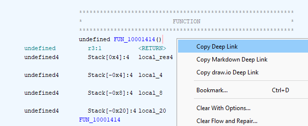
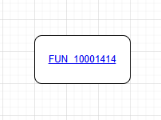
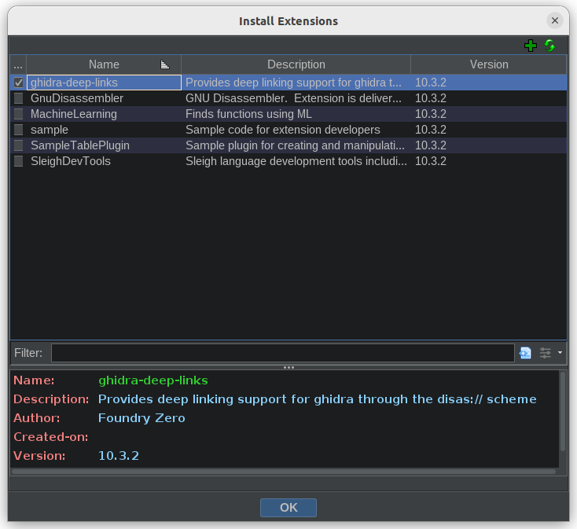
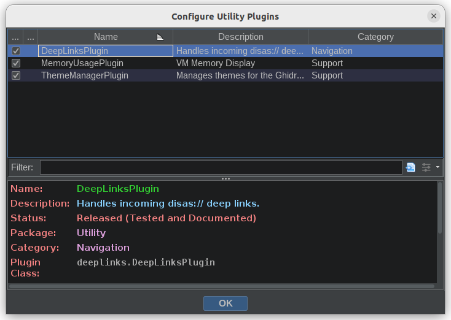

<p align="center">
  
</p>

# Ghidra Deep Links

A cross-platform plugin for Ghidra that provides deep linking support. This enables the generation of clickable `disas://` links that can be included in 3rd party applications. Example use cases include:

* Direct linking from research notes or reports to relevant binary locations.
* Sharing an interesting section address with peers over Slack, Discord, Teams etc.
* Including links in vulnerability write-ups or tutorials to direct readers to the exact address of an issue.
* Creating draw.io diagrams for documenting program structure with direct links to corresponding locations.

The linking mechanism will work across different project structures and with both shared and non-shared Ghidra projects.

## IDA support

Don't use Ghidra? Not a problem...

We have collaborated with the team behind Heimdallr, a plugin that provides deep linking support for IDA, on a new platform-agnostic URI schema so that links generated in Ghidra Deep Links can be opened by Heimdallr and vice versa. This assumes the exact same binary is loaded on both platforms. This is great as now teams can use their prefered disassembler while being able to use the same external notes and reference links. Check out Heimdallr over at: <https://github.com/interruptlabs/heimdallr-ida>

We invite other developers to adopt the `disas://` schema outlined in [URL format](#-url-format) to enable more cross-application compatibility.

## ▶️ Usage

With a CodeBrowser tool open, right click on a line in the listing view which will present new context menu items:



Click on the *Copy Deep Link* item and a `disas://` link will be added to the clipboard. This can be shared by pasting like any normal link.

When you (or somebody else) clicks on the link the referenced binary will open in a CodeBrowser session and the memory address from the link will be jumped to.

> ⚠️ Currently the link handler does not distinguish between projects, and (on non-linux platforms) it cannot open Ghidra by itself. Therefore you will need to have Ghidra open and the project containing the binary referenced in the link open.

You can use the *Copy Markdown Deep Link* context menu item to copy a fully formatted Markdown link, where the symbol name or address is the title of the link and the `disas://` URL is the target.

### Creating draw.io objects

The *Copy draw.io Deep Link* context menu item populates your clipboard with a [draw.io](https://draw.io) object. Pasting this into draw.io will add an object to your diagram, labelled with the symbol name or address of the location where you right-clicked. This object will have both the text and the object as a whole linked with the `disas://` URL to the original binary location. Here's what it will look like when pasted into your draw.io diagram:



If you save your diagram as an SVG image and open it in a browser, you will now be able to click on this object and Ghidra will navigate to the original location. This makes it easy to create diagrams visually documenting the relationship between important locations in your binary, and allowing easy navigation around them.

Top tip: use draw.io's [Editable SVG image](https://www.drawio.com/blog/xml-in-png) functionality to create an SVG file that you can load directly in draw.io.

### Python script usage

Ghidra Deep Links exposes an API endpoint `DeepLinksUtil.buildURL` for programmatically creating links from Python based scripts e.g.:

```
from deeplinks import DeepLinksUtil

addr = currentProgram.getSymbolTable().getGlobalSymbols("main")[0].getAddress()
disas_url = DeepLinksUtil.buildURL(addr, currentProgram)

print(disas_url)
```

This works for both PyGhidra and Jython runtimes.

## ⚙️ Installation

### Linux

1. Download and install the latest release of the ghidra-deep-links extension from <https://github.com/foundryzero/ghidra-deep-links/releases>

2. Install the `disas://` handler by executing the following:

    (Before curling and executing random scripts from the internet it is a good idea to validate they don't do anything malicious. Please review the contents of this script before execution at `install.sh`)

    ```bash
    bash -c "$(curl https://raw.githubusercontent.com/foundryzero/ghidra-deep-links/main/install.sh)"
    ```

3. Alternatively, clone this repo and run `install-offline.sh`.

4. Follow the instructions in [Plugin Activation](#plugin-activation) to complete the install.

### Windows

1. Download and install the latest release of the ghidra-deep-links extension from <https://github.com/foundryzero/ghidra-deep-links/releases>

2. Install the `disas://` handler by executing the following in a PowerShell window:

    (Before executing random PowerShell scripts from the internet it is a good idea to validate they don't do anything malicious. Please review the contents of this script before execution at `install.ps1`)

    ```ps
    Invoke-Expression (Invoke-WebRequest https://raw.githubusercontent.com/foundryzero/ghidra-deep-links/main/install.ps1).Content 
    ```

3. Alternatively, clone this repo and run `install-offline.ps1`.

4. Follow the instructions in [Plugin Activation](#plugin-activation) to complete the install.

### Mac

1. Download and install the latest release of the ghidra-deep-links extension from <https://github.com/foundryzero/ghidra-deep-links/releases>

2. Additionally download `GhidraDeepLinksHandler.dmg` from the above releases page, mount the dmg and install the handler app as normal (drag to Applications)

3. Run the following to disable Gatekeeper on the handler app.

    (This is required as we do not code sign our releases. Please review the code at `os/mac`. This can be compiled from source by following the steps in `.github/workflows/mac_app.yml`)

    ```bash
    xattr -d com.apple.quarantine /Applications/GhidraDeepLinksHandler.app
    ```

4. Follow the instructions in Plugin Activation below.

## Plugin Activation

1. From the Ghidra project browser click `File -> Install Extensions`. Click the green `+` button and select the extension downloaded from the releases page (Don't extract the zip archive).

    

2. In the main ghidra window (the one that shows your project files), go to `File -> Configure -> Utility` and enable `ghidra-deep-links`.

    

3. In a CodeBrowser window, go to `File -> Configure -> Utility` and enable `DeepLinksToolPlugin`.

4. Verify the extension is correctly installed by loading a project then visiting [disas://?ghidra_verify=true](disas://?ghidra_verify=true). This should open a dialog box in Ghidra.

# 🔨 Building

See [BUILDING.md](./BUILDING.md)

# 🔗 URL format

The URLs take the format

```raw
disas://<hash>/[?ghidra_path=<path>]&offset=<offset>[&label=<label>]
```

* `<hash>` is the MD5 hash of the binary
* `<ghidra_path>` is an optional location of the binary within a Ghidra project structure. It is used to speed up finding the binary of interest.
* `<offset>` is a memory address to jump to.
* `<label>` is the label associated with the offset if one is set. (For visual reference only)

If `<path>` cannot be found or does not match `<hash>`, the entire project will be searched for files that match `<hash>`, ignoring `<path>` entirely. This is to allow for differing project structures containing the same files and compatibility with `disas://` links generated by other applications, but can be quite slow in large projects.

Please consider adopting this schema when you want to create links to a location in a binary.

## ⚠️ Caveats & Known Issues

* `disas://` links cannot be opened from Snap applications.
* If multiple instances of ghidra are open, only the first will receive the link requests.
* Currently the link handler does not distinguish between projects, and (on non-linux platforms) it cannot open Ghidra by itself. Therefore you will need to have Ghidra open and the project containing the binary referenced in the link open.
* When the link handler falls back to lookup by hash links may take a few seconds to open on projects with many (i.e. hundreds of) binaries.
* On Windows a Powershell window may briefly flash open on each link press.
